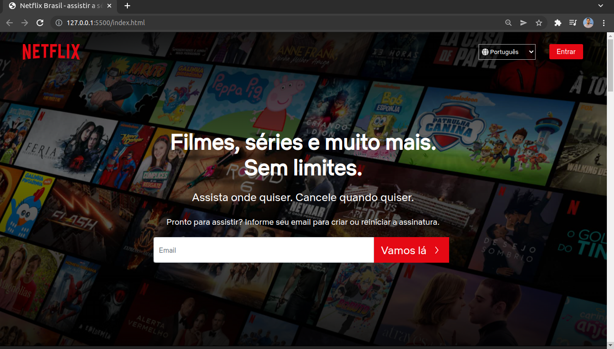
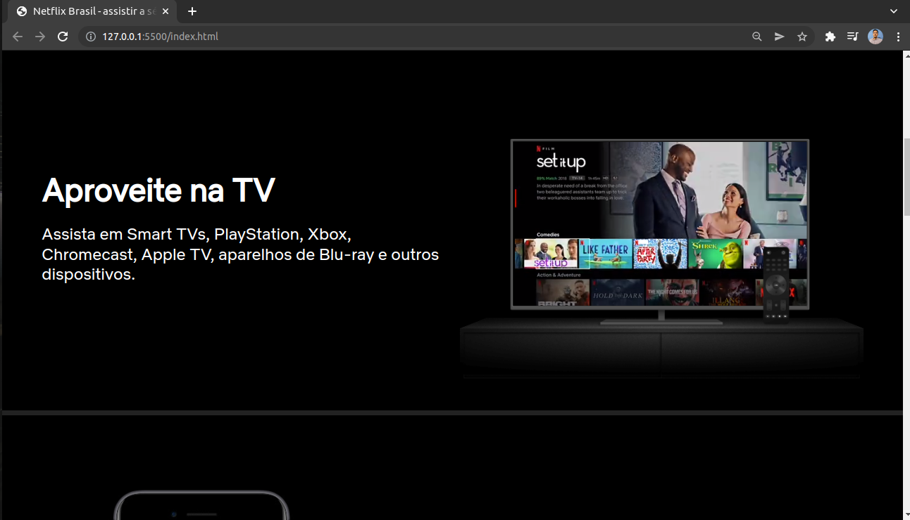
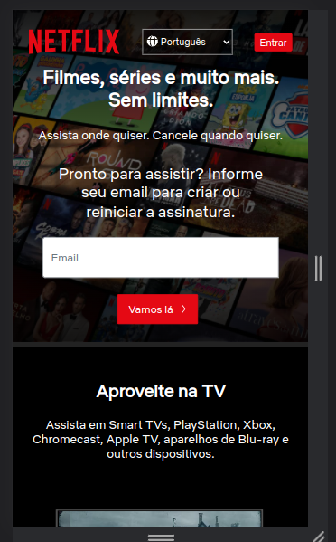

### Projeto Clone Netflix com Bootstrap

Desenvolve o clone da Netflix usando Bootstrap 5. Com o objetivo de praticar o framework, e obter familiaridade com essa versão.

## Tecnologias
- HTML
- CSS
- Bootstrap

## IMAGENS

# Responsivo

